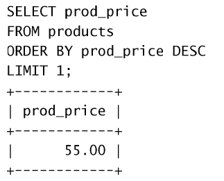
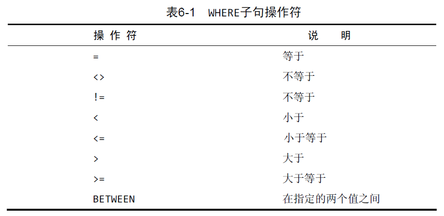
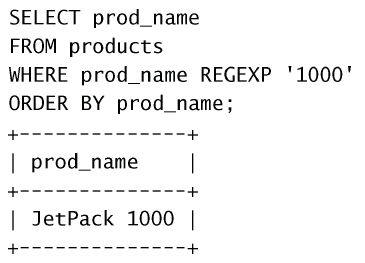
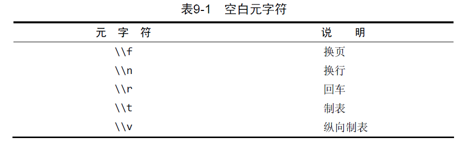
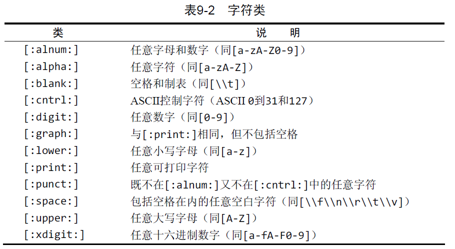
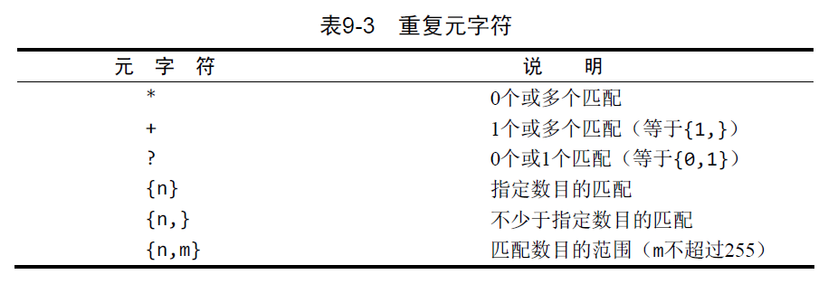
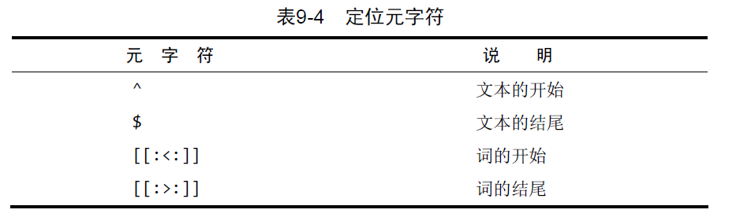

# SELECT语句

## 基本操作
SELECT 语句检索一个或多个列
```SQL
SELECT col_name FROM table_name;
SELECT col_name1, col_name2, ... FROM table_name;
SELECT * FROM table_name;
SELECT DISTINCT col_name ...; # 返回值不同的行
```
可以使用`LIMIT row_start, row_num`来限制输出数目，另一种形式为`LIMIT row_num OFFSET row_start`。

## 排序
如果不明确规定排序顺序，则不应该假定检索出的数据的顺序有意义。
```sql
SELECT col_name
FROM table_name
ORDER BY some_col_name; # 可以与选择列不同，也可以是多列

ORDER BY some_col_name DESC; # 逆序排列，DESC关键字只应用到直接位于其前面的列名
```
一个例子，用来寻找最高价格：


<!-- <p></p> -->

## 过滤
```sql
SELECT col_name
FROM table_name
WHERE condition
```
在同时使用ORDER BY和WHERE子句时，应该让ORDER BY位于WHERE之后。
WHERE条件：

注意：NULL不能被等于或不等于条件选出。

## 复杂的过滤条件
可以使用`AND`，`OR`, `NOT`和`IN`。

```SQL
# and
WHERE condition1 AND condition2
# or
WHERE condition1 OR condition2
# not
WHERE NOT condition1
# in
WHERE col_name in (item1, item2,...)
```

## 通配符
```SQL
WHERE col_name LIKE search_pattern # search_pattern 是一个字符串
```
搜索区分大小写。
- `%`: 表示任何字符出现任意次数。不能匹配NULL。
- `_`: 只匹配单个字符。
  
## 正则表达式
```SQL
WHERE col_name REGEXP search_pattern # search_pattern 是一个字符串
```
MySQL只支持少部分的正则表达式。
**单个**字符匹配：
- `.`: 任意一个字符。
- `|`: 搜索两个串之一（或者为这个串，或者为另一个串）。
- `[]`: 匹配几个字符之一。`[123]`是`[1|2|3]`的缩写。`[]`只能匹配单个字符，不能匹配字符串。可以使用`-`匹配范围,如`[123456789]`简写成`[1-9]`。

正则表达式默认只需要匹配列值的**一部分**，而LIKE需要匹配整个列值。

正则表达式默认不区分大小写，如要区分，需要在search_pattern前加上BINARY。

转义使用`\\`。


可以自定义字符类方便查找：


使用重复元字符：


定位符：
