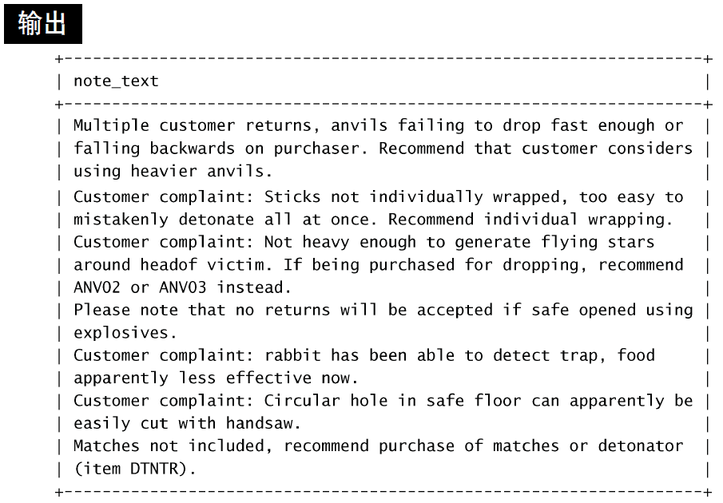
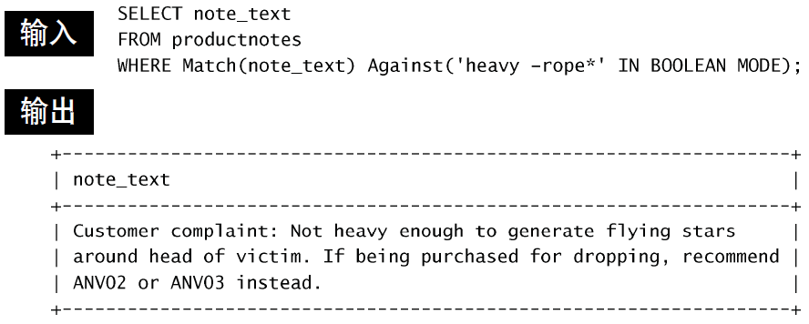

# 全文本搜索

只有部分数据库引擎支持全文本搜索，如`MyISAM`支持，而`InnoDB`不支持。

使用`LIKE`和正则表达式有时会存在一些限制，如效率低、难以处理更加复杂的问题等。

为了进行全文本搜索，必须索引被搜索的列，而且要随着数据的改变不断地重新索引。

## 启用全文本搜索
一般在创建表的时候使用`FULLTEXT`子句启用该功能。
如：

在定义之后，MySQL自动维护该索引。在增加、更新或删除行时，索引随之自动更新。

注意：不要在导入数据时使用FULLTEXT，应该先导入数据，再修改表，添加索引。

## 使用全文本搜索
使用`Match()`和`Against()`函数来进行搜索。如：

`Match()`内是被搜索的列，`Against()`内是被搜索的内容。

注意：
- `Match()`内内容必须与`FULLTEXT()`内一样
- 搜索不区分大小写

使用全文本搜索返回的结果是按照优先度排序的，文本中词靠前的行的等级值比词靠后的行的等级值高，数目多的等级值也更高。

## 使用查询扩展

语法：在`Against()`中添加`WITH QUERY EXPANSION`.

不使用查询扩展：
 
使用查询扩展：
 
 

查询扩展可以增加返回的结果。一般是按照被查询中的行中的内容进行一定规则的匹配。

## 使用布尔查询
语法：使用`IN BOOLEAN MODE`，如：

例子：找到含有`heavy`而不含以`rope`开头的单词的行：

全文本布尔操作符列表：

更多例子：

## 一些重要说明

