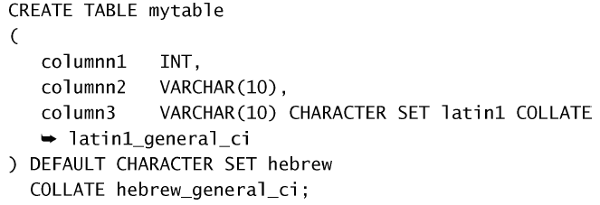

# 全球化和本地化

不同的语言和字符集需要以不同的方式存储和检索。因此，MySQL 需要适应不同的字符集（不同的字母和字符），适应不同的排序和检索数据的方法。

一些术语：

- 字符集为字母和符号的集合；
- 编码为某个字符集成员的内部表示；
- 校对为规定字符如何比较的指令。

使用何种字符集和校对的决定在服务器、数据库和表级进行。

## 使用字符集和校对顺序

- 使用`SHOW CHARACTER SET`查看支持的字符集。使用`SHOW COLLATION`查看所支持校对的完整列表。
- 使用`SHOW VARIABLES LIKE 'character%'`和`SHOW VARIABLES LIKE 'collation%'`查看默认的字符集和校对。

- 也可以对于表甚至列指定字符集和校对。如：  
  

- 如果需要也可以在`ORDER BY`之后使用`COLLATE`来指定临时的校对。

- 也可以使用`Cast()`或`Convert()`函数转换串的字符集。
