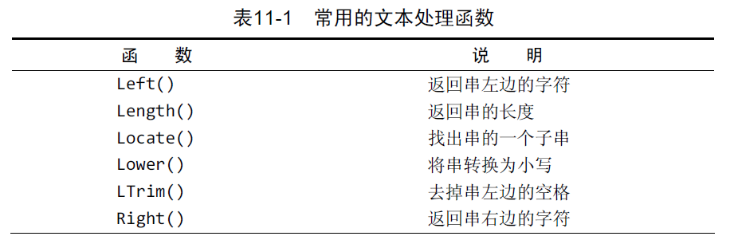
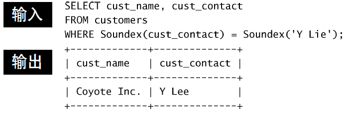
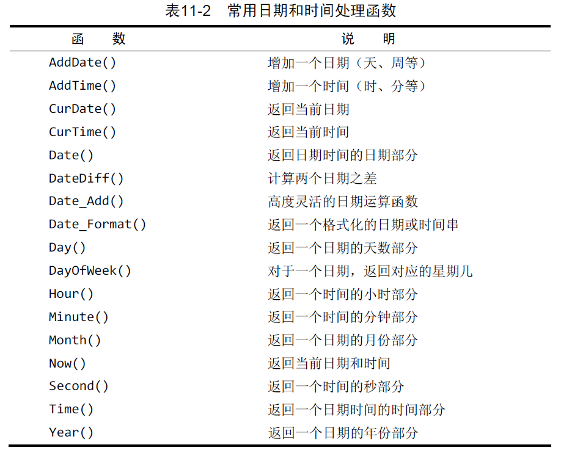
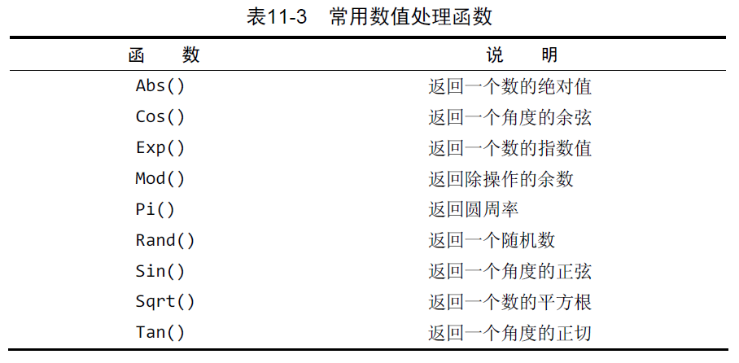
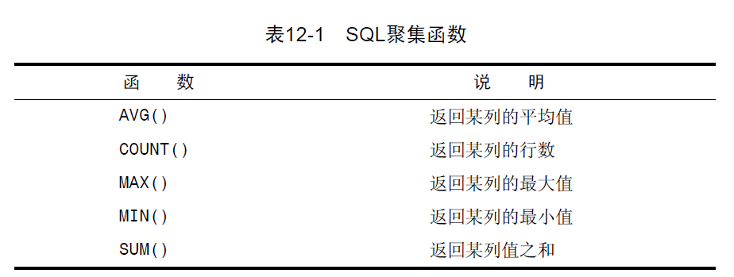

# 函数

## 文本函数

`Soundex()`用来比较文本发音的相似性。

## 日期和时间函数

日期格式为`yyyy-mm-dd`。

## 数值处理函数

## 聚集函数

注意：`COUNT(*)`计入`NULL`，而`COUNT(col_name)`不计入。

可以使用`DISTINCT col_name`选择列中不同的值进行统计（聚集）。

[官方文档：函数](https://dev.mysql.com/doc/refman/8.0/en/functions.html)
