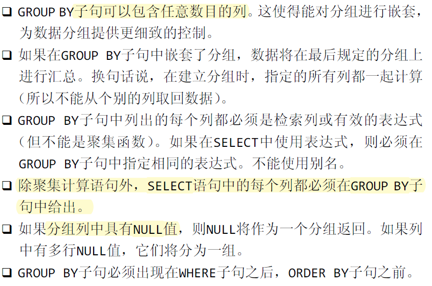
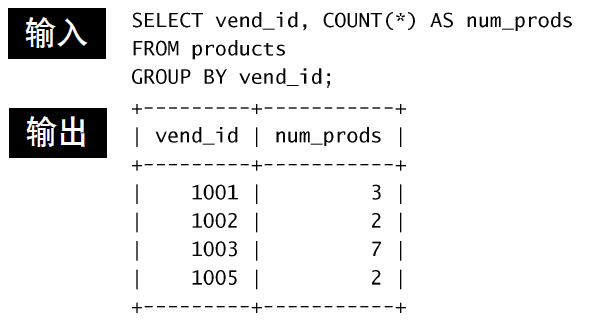
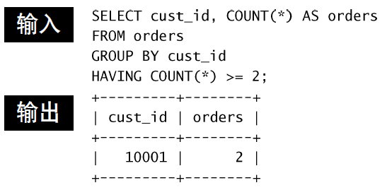
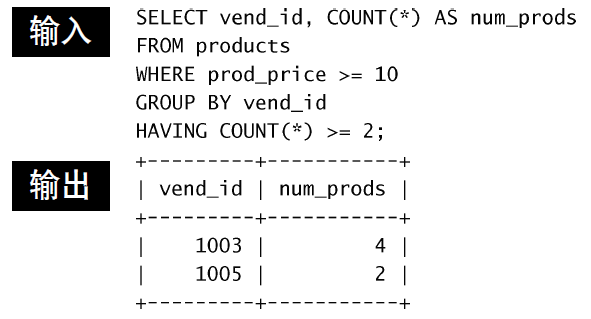
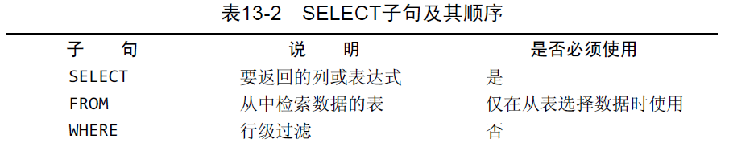
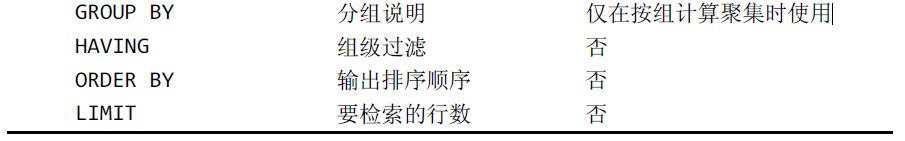

# 分组数据
## 基本分组
`GROUP BY`子句，将一个table按照某些列分组成多个小table，每个小table有相同的分组列。用于返回每个小table的聚集（统计）信息。注意并不一定能返回每个小table的完整信息。如：

|name | data |
|----|----|
|name1 | data1_1|
|name1 | data1_2|
|name1 | data1_3|
|name1 | data1_4|
|name2 | data2_1|
|name2 | data2_2|
|name2 | data2_3|

而只能返回：
|name | data |
|----|----|
|name1 | data1|
|name2 | data2|
也就是说，`data1`只能是`data1_1`到`data1_4`的一个映射。
语法：
```sql
SELECT col_name1,..., aggregate_func(col_name2)...
FROM table_name
GROUP BY col_name1,...
```
注意：



其中第4条，如果SELECT语句中有些列没有给出，也可以运行，但结果不知道对不对。（存有疑问）

例子：


如果想知道每个列的汇总信息，可以使用`ROLLUP`：
```sql
select vend_id, prod_price, count(*)
from products
group by vend_id, prod_price with rollup;
```
输出：
```
+---------+------------+----------+
| vend_id | prod_price | count(*) |
+---------+------------+----------+
|    1001 |          6 |        1 |
|    1001 |         10 |        1 |
|    1001 |         15 |        1 |
|    1001 |       NULL |        3 |
|    1002 |          3 |        1 |
|    1002 |          9 |        1 |
|    1002 |       NULL |        2 |
|    1003 |          3 |        2 |
|    1003 |          4 |        1 |
|    1003 |         10 |        2 |
|    1003 |         13 |        1 |
|    1003 |         50 |        1 |
|    1003 |       NULL |        7 |
|    1005 |         35 |        1 |
|    1005 |         55 |        1 |
|    1005 |       NULL |        2 |
|    NULL |       NULL |       14 |
+---------+------------+----------+
```
可以发现对于每一个`vend_id`，先考虑它下面不同的`price`，然后对于`price`进行汇总。最后对于`vend_id`也进行汇总。注意对价格分组时自动四舍五入了。

## 过滤分组

使用`HAVING`子句，非常类似于`WHERE`，但是前者作用于分组，而后者作用于行。


有时需要先过滤行，再过滤分组，可以同时使用`WHERE`和`HAVING`。


## 小结


