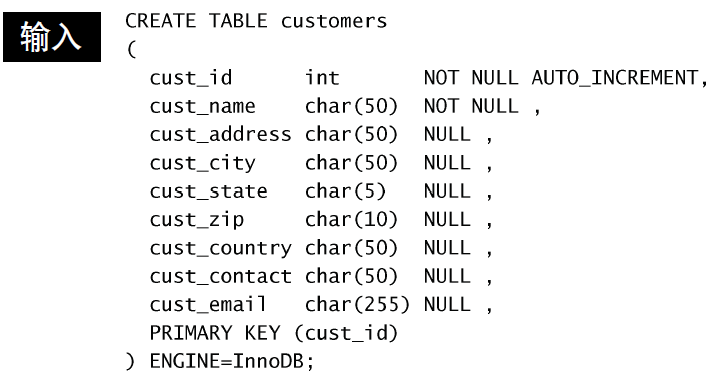
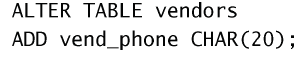
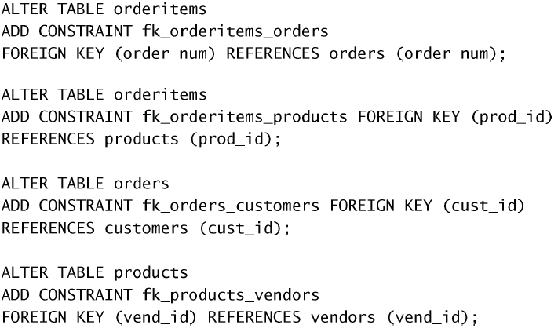

# 创建和操纵表

## 创建表

使用`CREATE TABLE`语句。

主键由`PRIMARY KEY`指定。

:warning: 如果同名的表已经存在，使用创建语句会报错；可以先删除表再创建，或者使用`IF NOT EXISTS`来创建。

每个表列或者是 NULL 列，或者是 NOT NULL 列，前者允许列值为 NULL，而后者不允许。

:warning: 空串`""`是一个有效的值，它不是无值。NULL 值用关键字 NULL 而不是空串指定。

使用`AUTO_INCREMENT`来指定**自动增量**。`last_insert_id()`返回最新的一个增量值。

`DEFAULT`可指定**默认值**。MySQL 不允许使用函数作为默认值。

### 使用引擎

- `InnoDB` 是一个可靠的事务处理引擎（参见第 26 章），它不支持全文
  本搜索；
- `MEMORY` 在功能等同于 MyISAM，但由于数据存储在内存（不是磁盘）
  中，速度很快（特别适合于临时表）；
- `MyISAM` 是一个性能极高的引擎，它支持全文本搜索（参见第 18 章），
  但不支持事务处理。

:question:什么是事务处理？

## 更新表

使用`ALTER TABLE`语句更新**表定义**。表的设计原则：后期尽量不要改动。

例如，增加列：  

删除列：  

定义外键：  

## 删除表

使用`DROP TABLE table_name`语句。

## 重命名表

使用`RENAME TABLE name1 TO name2`语句。
