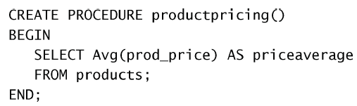
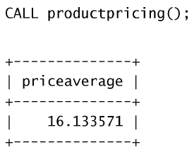
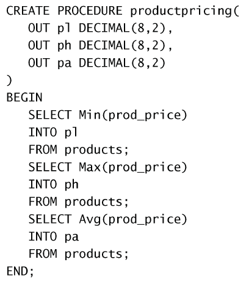
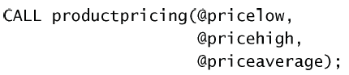
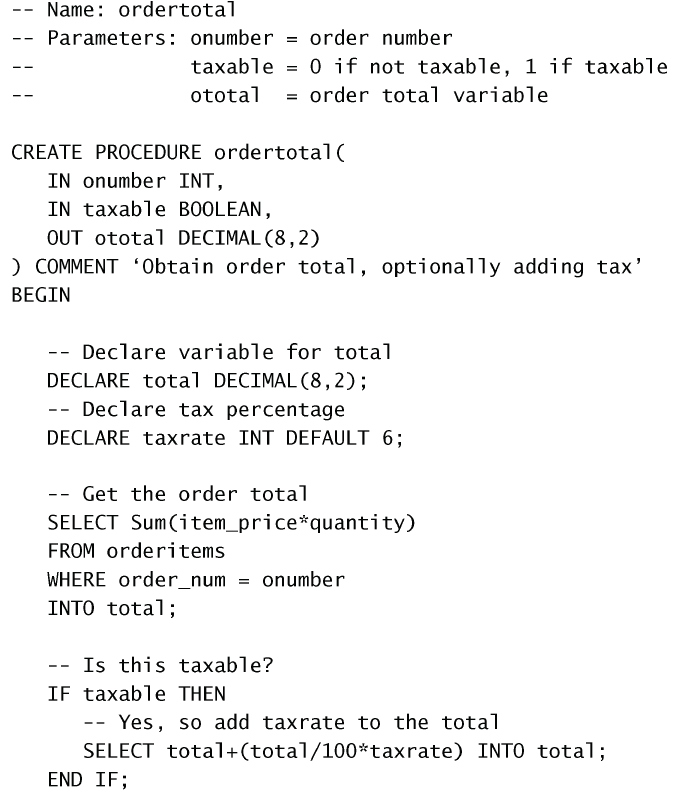
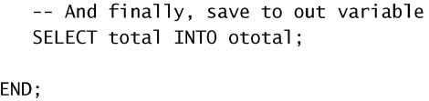

# 存储过程

存储过程简单来说，就是为以后的使用而保存的一条或多条MySQL语句的集合。这有点像过程式编程语言里面的函数。

## 创建存储过程

使用`CREATE PROCEDURE procedure_name(args)`来创建。一个简单的例子：  
  
这个例子其实就是对`SELECT`的一个简单封装。调用该存储过程时，返回价格的平均值。

## 调用存储过程
使用`CALL procedure_name(args)`来调用。如：  
  
结果是直接使用`SELECT`语句是一样的，不过可以重复调用。

## 删除存储过程

使用`DROP PROCEDURE procedure_name`。

## 使用参数

可以给存储过程添加参数。有三种类型的参数：
- `IN`：传递给存储过程（函数参数）
- `OUT`：从存储过程传出（函数返回值）
- `INOUT`：传入并传出（允许函数修改的变量？）

⚠️ 参数不可以是多行或多列的，只能符合一个单元格内的数据类型。

一个使用参数的例子：  
  
这里定义了三个输出参数。

调用：  
  
返回了三个变量（注意变量名要加上`@`）。之后这三个变量就可以被`SELECT`查看了。

## 更加复杂的例子

 
  
这里使用`DECLARE`在函数内定义临时变量。