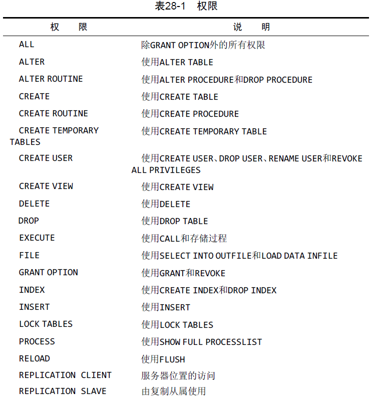
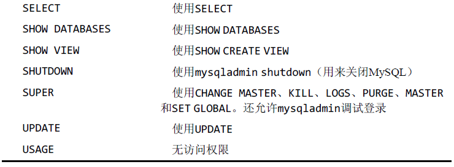

# 安全管理

用户应该对他们需要的数据具有适当的访问权，既不能多也不能少。

⚠️ 不要使用 root：应该严肃对待 root 登录的使用。

## 管理用户

MYSQL 的用户信息存储在 mysql 数据库中的 user 表中。

### 创建用户

使用`CREATE USER username IDENTIFIED BY password`创建用户

`IDENTIFIED BY`表示使用散列表来加密。

使用`RENAME USER`语句重命名用户。

### 删除用户账号

使用`DROP USER`语句删除账号以及相关的权限。

### 设置访问权限

使用`SHOW GRANTS FOR`，查看访问权限。

💡 新创建的用户权限会显示为`USAGE ON *.*`。`USAGE`表示**根本没有权限**，即新用户对任何东西都没有权限。

使用`GRANT`语句授予用户部分权限。使用`REVOKE`撤销特定的权限。

下面是可以赋予的权限列表：  
 

💡 即使表或数据库不存在，也可以对其进行授权。

### 更改口令

使用`SET PASSWORD = Password(...)`语句修改口令。
