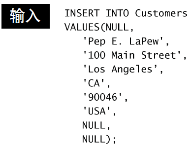
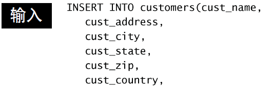
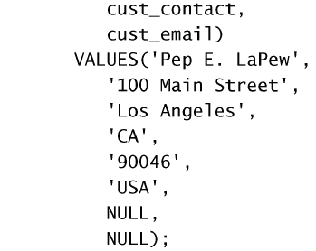
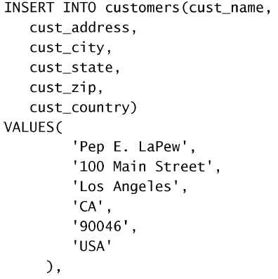
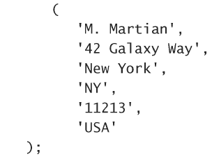
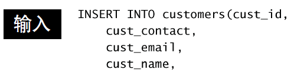
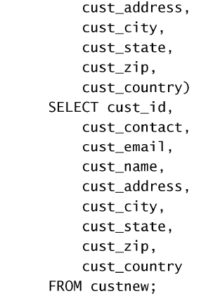

# 插入数据
使用`INSERT`。
## 插入一个完整的行
需要指定表名和被插入到新行中的值。如：

各个列必须以它们在表定义中出现的次序填充。第一列ID是`INCREMENTAL`类型的，所以只需要输入`NULL`。

虽然这种语法很简单，但并**不安全，应该尽量避免使用**。更加安全的语法为：

因为提供了列名，`VALUES`必须以其指定的次序匹配指定的列名，不一定按各个列出现在实际表中的次序。可以只对部分列插入值，其余列自动插入`NULL`（如果列允许赋值`NULL`的话），或使用默认值（如果该列有默认值）。

注意：`INSERT`操作可能很耗时（特别是有很多索引需要更新时），而且它可能
降低等待处理的`SELECT`语句的性能。可以使用`INSERT LOW_PRIORITY INTO`降低对速度的影响。

## 插入多行

可以在`VALUES`内接入多行信息，如：

 

## 插入检索出的数据
这其实就是把`VALUES`换成了`SELECT`检索出来的信息。如：  

