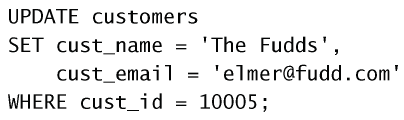
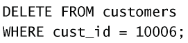
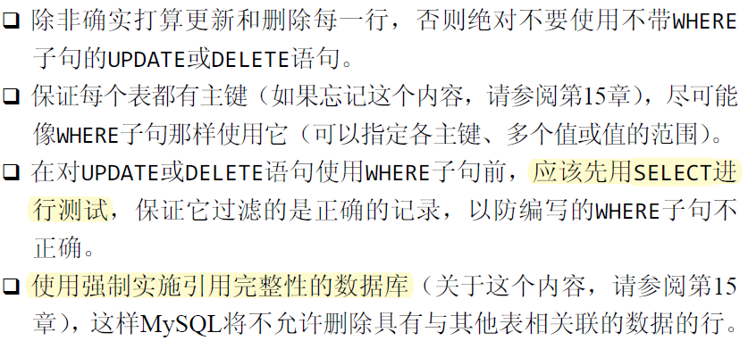

# 更新和删除数据

## 更新列
使用`UPDATE SET`,如：

有时表格更新的过程中会发生错误，表格会被恢复到之前的状态。如果希望忽略错误，不回退表格数据，可以使用`UPDATE IGNORE table_name`。

为了**删除某个列的值**，可设置它为`NULL`。

## 删除行
使用`DELETE`语句。

注意：
- DELETE不需要列名或通配符。
- DELETE删除整行而不是删除列。为了删除指定的列，请使用UPDATE语句。
- DELETE不删除表本身。

一些普遍遵守的习惯：

## 小结

四大操作：增、删、查、改。
| 操作 | 语句     | 功能                     |
| ---- | -------- | ------------------------ |
| 增   | `INSERT` | 加入一行/多行数据        |
| 删   | `DELETE` | 删除一行/多行数据        |
| 查   | `SELECT` | 查询一行/多行的一列/多列 |
| 改   | `UPDATE` | 修改一行/多行的一列/多列 |

目前还没有讲到增加、删除一列的操作。只有使用`UPDATA`删除列中的值。