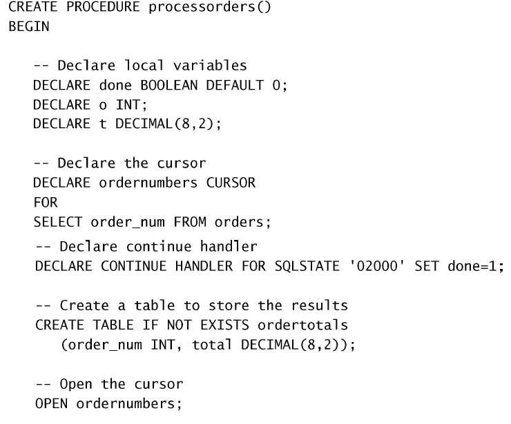

# 游标

有时，需要在检索出来的行中前进或后退一行或多行。

游标（cursor）是一个存储在 MySQL 服务器上的数据库查询，它不是一条`SELECT`语句，而是被该语句检索出来的结果集。在存储了游标之后，应用程序可以根据需要滚动或浏览其中的数据。

:warning: 在 MySQL 中，游标只能在存储过程（或函数）内使用。

## 创建、打开和关闭游标

一个简单的例子：  

可以看到游标定义在存储过程里面。首先需要使用`DECLARE`声明一个游标，类似于将一个结果集变成可迭代的。之后使用`OPEN`和`CLOSE`来打开和关闭游标。

## 使用游标

使用`FETCH`语句来从游标中依次获取数据。以下是一个例子：  
 

其中`CONTINUE HANDLER`是使用状态`02000`（未找到条件的错误代码）来判断循环结束的。这个代码的大致意思是不停地将游标内的数据传到`o`里面去。

## 更复杂的例子

 
 

这里定义的这个存储过程首先创建了一个空的新表。利用游标来处理数据，最后得到了一个有数据的新表。
