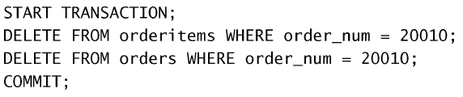

# 管理事务处理

## 介绍

事务处理（transaction processing）是一种机制，用来管理必须成批执行的 MySQL 操作，以保证数据库不包含不完整的操作结果。

利用事务处理，可以保证一组操作不会中途停止，它们或者作为整体执行，或者完全不执行（除非明确指示）。如果没有错误发生，整组语句提交给（写到）数据库表。如果发生错误，则进行回退（撤销）以恢复数据库到某个已知且安全的状态。

一些术语：

- 事务（transaction）指一组 SQL 语句；
- 回退（rollback）指撤销指定 SQL 语句的过程；
- 提交（commit）指将未存储的 SQL 语句结果写入数据库表；
- 保留点（savepoint）指事务处理中设置的临时占位符（placeholder），你可以对它发布回退（与回退整个事务处理不同）。

## 控制事务处理

使用`START TRANSACTION`开始事务处理。

### 回退

在执行一条`START TRANSACTION`命令之后可以使用`ROLLBACK`回退到事务处理之前。只有`INSERT`、`UPDATE`和`DELETE`语句会回退。

### 提交更改

一般的MySQL语句都是直接针对数据库表执行和编写的。这就是所谓的隐含提交。在事务处理时，必须使用`COMMIT`明确提交。

例如：  
  
最后的`COMMIT`语句仅在不出错时写出更改。

⚠️ 当COMMIT或ROLLBACK语句执行后，事务会自动关闭（将来的更改会隐含提交）。

### 使用保留点

对于更复杂的事务处理可能需要部分提交或回退。可以使用使用`SAVEPOINT sp_name`语句创建保留点。

可以使用`ROLLBACK sp_name`回到保留点。

:bulb: 保留点越多越好。

:warning: 保留点在事务处理完成（执行一条`ROLLBACK`或
`COMMIT`）后自动释放。也可以使用`RELEASE SAVEPOINT`明确地释放保留点。

### 更改默认的提交行为

为指示MySQL不自动提交更改，可以`SET autocommit=0`，这样必须使用`COMMIT`才能提交更改。

⚠️ 该标志是连接专用的，不影响服务器。