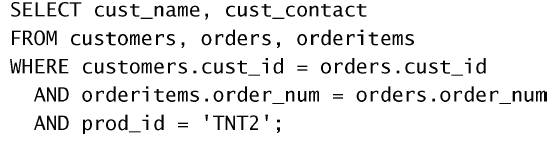
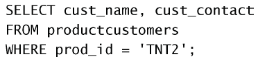
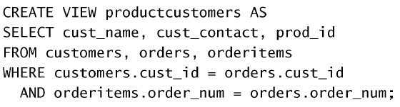

# 视图

视图是一个虚拟的表（多个表的部分组合），不包含数据。例如可以将以下查询的部分定义成一个视图`productcustomers`：  

可以像使用的普通表一样使用它：  

## 为什么使用视图？

下面是视图的一些常见应用。

- 重用SQL语句。
- 简化复杂的SQL操作。在编写查询后，可以方便地重用它而不必
知道它的基本查询细节。
- 使用表的组成部分而不是整个表。
- 保护数据。可以给用户授予表的特定部分的访问权限而不是整个
表的访问权限。
- 更改数据格式和表示。视图可返回与底层表的表示和格式不同的
数据。

可以对视图执行`SELECT`操作，过滤和排序数据，将视图联结到其他视图或表，甚
至能添加和更新数据（添加和更新数据存在某些限制。关于这个内容稍后还要做进一步的介绍）。

## 使用方法

- 视图用`CREATE VIEW`语句来创建。
- 使用`SHOW CREATE VIEW viewname`；来查看创建视图的语句。
- 用DROP删除视图，其语法为`DROP VIEW viewname;`。
- 更新视图时，可以先用`DROP`再用`CREATE`，也可以直接用`CREATE ORREPLACE VIEW`。如果要更新的视图不存在，则第2条更新语句会创建一个视图；如果要更新的视图存在，则第2条更新语句会替换原有视图。

例如，创建视图：  

## 更新视图

一般来说是允许更新视图的，实际上是在更新**基数据**。

但如果基数据无法正确地被确定，则不允许更新。包含以下操作的视图无法更新：

- 组（使用GROUP BY和HAVING）；
- 联结；
- 子查询；
- 并；
- 聚集函数（Min()、Count()、Sum()等）；
- DISTINCT；
- 导出（计算）列。

⚠️可能的变动 上面列出的限制自MySQL 5以来是正确的。不过，未来的MySQL很可能会取消某些限制。