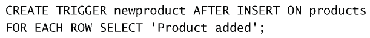
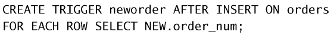
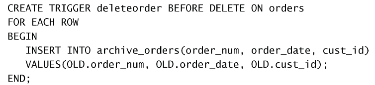
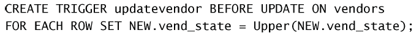

# 触发器

有时我们想要某条语句（或某些语句）在事件发生时自动执行。触发器是 MySQL 响应以下任意语句而自动执行的一条 MySQL 语句：

- DELETE；
- INSERT；
- UPDATE。

:bulb: 其他语句不支持，但不知道新版本是否支持更多。

## 创建触发器

触发器用`CREATE TRIGGER`语句创建。需要给出 4 条信息：

- 唯一的触发器名；
- 触发器关联的表；
- 触发器应该响应的活动（DELETE、INSERT 或 UPDATE）；
- 触发器何时执行（处理之前或之后）。

以下是一个例子：  

这表示对每个插入表的行打印一次示`Product added`。

其中：

- `AFTER INSERT`是触发条件，表示当插入表操作完成后触发；
- `FOR EACH ROW`是对插入的每一行进行操作。

每个表每个事件每次只允许一个触发器。因此，每个表最多支持6个触发器（每条INSERT、UPDATE和DELETE的之前和之后）。只有表才支持触发器，视图不支持。

如果BEFORE触发器失败，则MySQL将不执行请求的操作。此外，如果BEFORE触发器或语句本身失败，MySQL将不执行AFTER触发器（如果有的话）。

## 删除触发器

使用`DELETE TRIGGER`删除。为了修改一个触发器，必须先删除它，然后再重新创建。

## 使用触发器

### `INSERT`触发器

- 在`INSERT`触发器代码内，可引用一个名为`NEW`的虚拟表，访问被
插入的行；
- 在`BEFORE INSERT`触发器中，`NEW`中的值也可以被更新（允许更改
被插入的值）；
- 对于`AUTO_INCREMENT`列，`NEW`在`INSERT`执行之前包含`0`，在`INSERT`
执行之后包含新的自动生成值。

例如：  

在数据插入表后，会自动生成一个订单号，这个触发器获取这个新的订单号。

💡 通常，将BEFORE用于数据验证和净化（目的是保证插入表中的数据确实是需要的数据）。

### `DELETE`触发器

- 在`DELETE`触发器代码内，你可以引用一个名为`OLD`的虚拟表，访
问被删除的行；
- `OLD`中的值全都是只读的，不能更新。

一个例子：  

💡 使用BEFORE DELETE触发器的优点（相对于AFTER DELETE触发器来说）为，如果由于某种原因，订单不能存档，DELETE本身将被放弃。这样就保护了信息。

### `UPDATE`触发器

- 在`UPDATE`触发器代码中，你可以引用一个名为`OLD`的虚拟表访问
以前（`UPDATE`语句前）的值，引用一个名为`NEW`的虚拟表访问新
更新的值；
- 在`BEFORE UPDATE`触发器中，`NEW`中的值可能也被更新（允许更改
将要用于`UPDATE`语句中的值）；
- `OLD`中的值全都是只读的，不能更新。

例如：  

