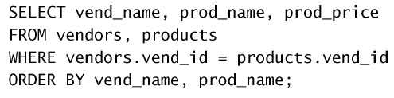
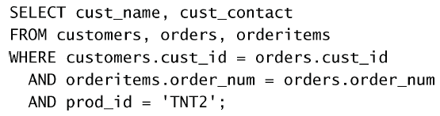
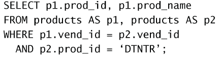
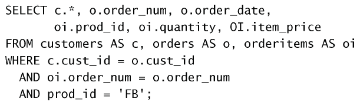

# 连结
## 背景
我们不希望数据库中的数据有所重复，所以按照一类信息一个表来存储。
两个表可以通过各自的某一列来相互关联。

## 内部连结
**外键**（foreign key）为某个表中的一列，它包含另一个表的主键值，定义了两个表之间的关系。

（个人理解）连结其实就是把两个表根据某个对应的列给合并起来，比如，表1是订单信息，表2是用户信息，表1中存储了每个订单对应的用户ID，而表2中每个用户也有一个ID，ID在两个表中是重复的，所以可以通过把ID把两个表给合并起来（变得更宽）。

一个简单的例子：



这是一个**等值连结**，也叫**内部连结**。
也可以使用`INNER JOIN`来实现：


效果和使用`WHERE`的是一样的，但一般推荐使用。


也可以连结多个表，如：



避免了重复使用SELECT。

## 自连结
有时候我们需要在一个表中选择某些列，然后查询它所对应的别的列的信息。比如：有一个存有商品信息的表，我们发现某个商品有问题，我们想检查一下同一家公司的其他商品是否有问题。首先我们需要找到该商品对应的公司ID，然后查询该ID对应的所有商品。
可以使用两次`SELECT`，也可以使用自连结，如下：



`p1`和`p2`是给`products`起的别名，因为我们需要连结同一个表，所以必须使用别名。

## 自然连结
`INNER JOIN`本身允许返回相同的列，比如：
```sql
select * 
from vendors inner join products
on vendors.vend_id = products.vend_id;
```
输出：
```
+---------+-------------+-----------------+-------------+------------+----------+--------------+---------+---------+----------------+------------+----------------------------------------------------------------+
| vend_id | vend_name   | vend_address    | vend_city   | vend_state | vend_zip | vend_country | prod_id | vend_id | prod_name      | prod_price | prod_desc                                                      |
+---------+-------------+-----------------+-------------+------------+----------+--------------+---------+---------+----------------+------------+----------------------------------------------------------------+
|    1001 | Anvils R Us | 123 Main Street | Southfield  | MI         | 48075    | USA          | ANV01   |    1001 | .5 ton anvil   |       5.99 | .5 ton anvil, black, complete with handy hook                  |
|    1001 | Anvils R Us | 123 Main Street | Southfield  | MI         | 48075    | USA          | ANV02   |    1001 | 1 ton anvil    |       9.99 | 1 ton anvil, black, complete with handy hook and carrying case |
|    1001 | Anvils R Us | 123 Main Street | Southfield  | MI         | 48075    | USA          | ANV03   |    1001 | 2 ton anvil    |      14.99 | 2 ton anvil, black, complete with handy hook and carrying case |
|    1002 | LT Supplies | 500 Park Street | Anytown     | OH         | 44333    | USA          | FU1     |    1002 | Fuses          |       3.42 | 1 dozen, extra long                                            |
|    1002 | LT Supplies | 500 Park Street | Anytown     | OH         | 44333    | USA          | OL1     |    1002 | Oil can        |       8.99 | Oil can, red                                                   |
|    1003 | ACME        | 555 High Street | Los Angeles | CA         | 90046    | USA          | DTNTR   |    1003 | Detonator      |      13.00 | Detonator (plunger powered), fuses not included                |
|    1003 | ACME        | 555 High Street | Los Angeles | CA         | 90046    | USA          | FB      |    1003 | Bird seed      |      10.00 | Large bag (suitable for road runners)                          |
|    1003 | ACME        | 555 High Street | Los Angeles | CA         | 90046    | USA          | FC      |    1003 | Carrots        |       2.50 | Carrots (rabbit hunting season only)                           |
|    1003 | ACME        | 555 High Street | Los Angeles | CA         | 90046    | USA          | SAFE    |    1003 | Safe           |      50.00 | Safe with combination lock                                     |
|    1003 | ACME        | 555 High Street | Los Angeles | CA         | 90046    | USA          | SLING   |    1003 | Sling          |       4.49 | Sling, one size fits all                                       |
|    1003 | ACME        | 555 High Street | Los Angeles | CA         | 90046    | USA          | TNT1    |    1003 | TNT (1 stick)  |       2.50 | TNT, red, single stick                                         |
|    1003 | ACME        | 555 High Street | Los Angeles | CA         | 90046    | USA          | TNT2    |    1003 | TNT (5 sticks) |      10.00 | TNT, red, pack of 10 sticks                                    |
|    1005 | Jet Set     | 42 Galaxy Road  | London      | NULL       | N16 6PS  | England      | JP1000  |    1005 | JetPack 1000   |      35.00 | JetPack 1000, intended for single use                          |
|    1005 | Jet Set     | 42 Galaxy Road  | London      | NULL       | N16 6PS  | England      | JP2000  |    1005 | JetPack 2000   |      55.00 | JetPack 2000, multi-use                                        |
+---------+-------------+-----------------+-------------+------------+----------+--------------+---------+---------+----------------+------------+----------------------------------------------------------------+
```
可以发现作为共有列的`vend_id`被重复返回了。要控制返回的表没有重复列（自然连结），需要用户自己来实现。如对需要查询的表使用`*`，其他列明确给出：



总之，自然连结不是一种语法规则，而是一种连结的类型。最终需要用户自己实现。

## 外部连结

在内部连结中，选取的是两个表中作为外键的列的**公共部分**。外部连结是指定以某一个表的外键为准，即使另一个表没有该表中某行的信息，也用NULL补全。
例子：
`customer`表：
```
+---------+----------------+---------------------+-----------+------------+----------+--------------+--------------+---------------------+
| cust_id | cust_name      | cust_address        | cust_city | cust_state | cust_zip | cust_country | cust_contact | cust_email          |
+---------+----------------+---------------------+-----------+------------+----------+--------------+--------------+---------------------+
|   10001 | Coyote Inc.    | 200 Maple Lane      | Detroit   | MI         | 44444    | USA          | Y Lee        | ylee@coyote.com     |
|   10002 | Mouse House    | 333 Fromage Lane    | Columbus  | OH         | 43333    | USA          | Jerry Mouse  | NULL                |
|   10003 | Wascals        | 1 Sunny Place       | Muncie    | IN         | 42222    | USA          | Jim Jones    | rabbit@wascally.com |
|   10004 | Yosemite Place | 829 Riverside Drive | Phoenix   | AZ         | 88888    | USA          | Y Sam        | sam@yosemite.com    |
|   10005 | E Fudd         | 4545 53rd Street    | Chicago   | IL         | 54545    | USA          | E Fudd       | NULL                |
+---------+----------------+---------------------+-----------+------------+----------+--------------+--------------+---------------------+
```

`orders`:
```
+-----------+---------------------+---------+
| order_num | order_date          | cust_id |
+-----------+---------------------+---------+
|     20005 | 2005-09-01 00:00:00 |   10001 |
|     20006 | 2005-09-12 00:00:00 |   10003 |
|     20007 | 2005-09-30 00:00:00 |   10004 |
|     20008 | 2005-10-03 00:00:00 |   10005 |
|     20009 | 2005-10-08 00:00:00 |   10001 |
+-----------+---------------------+---------+
```
可以看到`10002`号顾客没有下订单。
使用`INNER JOIN`：
```sql
select customers.cust_id, order_num
from customers inner join orders
on customers.cust_id = orders.cust_id;
```

输出：
```
+---------+-----------+
| cust_id | order_num |
+---------+-----------+
|   10001 |     20005 |
|   10001 |     20009 |
|   10003 |     20006 |
|   10004 |     20007 |
|   10005 |     20008 |
+---------+-----------+
```
可以看到输出中并没有`10002`，而且`orders`中重复的`10001`也会重复出现。
```sql
select customers.cust_id, order_num
from customers left outer join orders
on customers.cust_id = orders.cust_id;
```
输出：
```
+---------+-----------+
| cust_id | order_num |
+---------+-----------+
|   10001 |     20005 |
|   10001 |     20009 |
|   10002 |      NULL |
|   10003 |     20006 |
|   10004 |     20007 |
|   10005 |     20008 |
+---------+-----------+
```
可以看到`10002`出现了，但是订单号是`NULL`.

我们也可以把`JOIN`和`GROUP BY`组合使用，如：


输出的是每个有订单的顾客的订单数。
